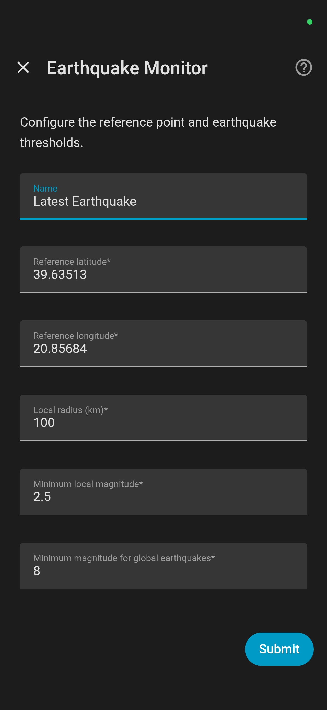
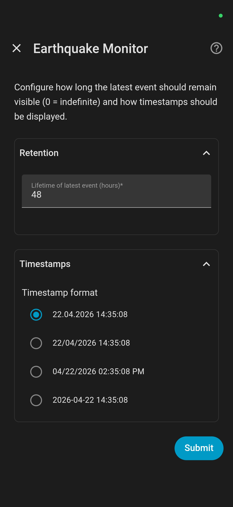

<p align="center">
  
</p>

# Earthquake Monitor
## **A Custom Integration for Home Assistant**

(c) 2026 Frank O. Fackelmayer, Ioannina, Greece – Contact: frank@fackelmayer.eu
 
Version 1.7.0


This integration reports the latest earthquake that matches a user-defined reference location and minimum magnitude threshold. It uses the EMSC real-time feed and exposes it as a sensor with rich attributes such as magnitude, time, depth, distance, bearing, and relative location. These attributes can then be used within Home Assistant, e.g. to display the information on a tile card, on the Home Assistant Map, or to trigger routines. 

**Disclaimer:** This integration is intended for informational use only. Under no circumstances should it be used to control critical processes, automated responses, safety-relevant systems, or infrastructure.

## What this integration does

Earthquake Monitor connects to the [**real-time WebSocket feed**](https://seismicportal.eu/realtime.html) of the [European-Mediterranean Seismological Centre (EMSC)](https://www.emsc.eu/) and keeps track of the most recent earthquake that matches the configured criteria. Despite the name, the EMSC feed covers all earthquakes worldwide.

The integration provides a Home Assistant sensor that includes:

- a unique identifier for every earthquake
- magnitude
- local and UTC timestamps
- depth
- region
- epicenter coordinates
- distance from a configured reference point
- bearing from the reference point (map-intuitive and geodetically correct shortest path on great circle)
- relative location such as `42.3 km SW of reference point`
- country of epicenter
- nearest city (population >25000) to epicenter ("none" for very remote places or offshore points)


The integration is intended for users who want a meaningful and stable “latest earthquake” entity in Home Assistant rather than observing a raw stream of feed updates in a web browser. It filters the feed and reports local earthquakes if they are within the configured radius around a reference point (typically, the user's home zone) and above the configured magnitude threshold. Stronger earthquakes outside the local radius are reported if they exceed a separate global threshold. Note that these will overwrite weaker local earthquakes when only one entity is configured. If reporting global earthquakes is not desired, set the global threshold to 10. 

This integration was inspired by the [**EMSC Earthquake** custom integration](https://github.com/febalci/ha_emsc_earthquake) by [febalci](https://github.com/febalci), but provides revised selection logic, improved usability, persistence, localization, and richer location metadata.

**Main improvements include:**

- **Improved event selection logic:**
  The EMSC feed reports both *new* events and *updates* to older events. The Earthquake Monitor entity discriminates between these in its `action` attribute, which is \`create\` for new events, or \`update\` for older events. If a newer earthquake has already been accepted, later updates to an older earthquake will be ignored. This prevents corrections to older events from overwriting the true latest event. Thus, the entity always provides the details (new or updated) of the latest recorded earthquake.

- **Improved configuration flow with validation of the user input:**
  Configuration settings provide good defaults, and every user input is validated to only allow a meaningful value. 

- **Relative location information:**
  The sensor provides distance, bearing, and a readable relative location based on the configured reference point. For easier reference, it also provides the country of the epicenter and the name of the nearest city to the epicenter.

- **Map support:**
  The sensor correctly implements the attributes `latitude` and `longitude` so that events can be displayed directly on Home Assistant map cards.

- **Persistence across restarts:**
  The last accepted earthquake is restored after a restart of Home Assistant.

- **Clearing the sensor after user-configured time:**
  To avoid an earthquake to be shown forever, the sensor will automatically be cleared some time after its last update. This lifetime can be set by the user during configuration of a sensor. 

- **Various translations:**
  The currently available 15 translations are listed below. These languages were selected to cover a large percentage of HA users, especially in earthquake-prone countries. If your native language is missing, please drop me a note (and help in translation if you can).


## Installation

### Installation through the Home Assistant Community Store (HACS)

The integration can be installed through HACS following these steps:

1.	Add ```https://github.com/fra-yer/Earthquake-Monitor``` to **HACS → Custom repositories** with type **Integration**
2.	Open the repository in HACS and click **Download**
3.	Restart Home Assistant
4.	Go to **Settings → Devices & Services → Add Integration**
5.	Search for **Earthquake Monitor**
6.	Complete the configuration dialog, following the guidelines below


### Manual installation

Alternatively, the integration can be installed manually from this Github repository:

1. Copy the `earthquake_monitor` folder (with all its contents) into:
```
	/config/custom_components/
```
2. Restart Home Assistant
3. Go to **Settings → Devices & Services → Add Integration**
4. Search for **Earthquake Monitor**
5. Complete the configuration dialog, following the guidelines below


## Configuration

All relevant parameters for the Earthquake Monitor can be set on the configuration page that appears automatically when the integration is started for the first time, or when the cog icon of an entity (on the main page of the integration) is clicked. See below for a detailed description of the individual parameters and their default values. You can set up more than one entity, which will provide independent sensors within Home Assistant (e.g. for two different zones of interest). Note that the configuration of every service/entity is split in two screens - the first is for the configuration of the reference point and criteria for reporting earthquakes, while the second is for setting the lifetime of the latest event and the user-defined format of timestamps. 

<p align="center">
  
  

### Name

The display name of the sensor service and its entity created by the integration. This field is only shown when the sensor is set up for the first time. Default is "Latest Earthquake" (or the equivalent in local translations\*). Keep it as the default unless you are not happy with this name. *If you create more than one service, make sure you give them different names so you can tell them apart!*

\* Note that the default name follows Home Assistant’s *backend language* set under Settings → System → Home Information → Language, not the frontend language set in your individual user profile. Ideally, it would follow the frontend language, but a known limitation in Home Assistant’s current architecture means that only the backend language setting can be used here.

### Reference latitude

Latitude of the point from which local distance and bearing are calculated. If the user has defined a zone named "Earthquake Reference" (or "earthquake_reference") in Home Assistant -> Settings -> Areas, Labels & Zones -> Zones, the center of this zone will be used as default setting for the latitude (and longitude). If no such zone exists, the integration will use the latitude of the user's home zone, rounded to 5 digits. This corresponds to an accuracy of around 1 m on the earth's surface. More than 5 decimal digits may be defined here, but provide no benefit.

### Reference longitude

Longitude of the point from which local distance and bearing are calculated. As for the latitude, the longitude will default to the center of the "Earthquake Reference" zone, or of the user's home zone. Also for longitude, more than 5 decimal digits provide no benefit.

### Local radius (km)

The radius around the reference point within which earthquakes are considered local and should be reported. If an "Earthquake Reference" zone exists, its radius will be used, otherwise a default of 100 km will be suggested. The maximum that can be set is 500 km.

### Minimum local magnitude

The minimum magnitude required for a *local* earthquake to be reported. Values from 0 to 10 are accepted. Values lower than 3 represent earthquakes that are too weak to be felt by humans; thus, setting the minimum local magnitude to much less than 3 will report many insignificant earthquakes, and should be avoided unless reporting of very weak quakes is desired. Check the [information about earthquake magnitudes](https://github.com/fra-yer/Earthquake-Monitor/blob/main/README.md#earthquake-magnitude-and-intensity) below. The default value is magnitude 2.5. 

### Minimum magnitude for global earthquakes

A second threshold that allows stronger earthquakes *outside the local radius* to be accepted as well. Values from 0 to 10 are accepted. Note that this global threshold cannot be set lower than the local minimum threshold. The default value is 8, which will only report very major earthquakes outside the local radius. 
*Set it to 10 if you do NOT want global earthquakes to be reported at all.*

### Lifetime of latest event

This setting allows to keep the latest event for a defined amount of time, and then automatically "clear" the sensor. The default is 48 hours, which means that the sensor will clear two days after its last update. When this happens, the sensor will change its `status` attribute from "active" to "clear". 
When the lifetime is set to 0, data of the last earthquake will never be cleared; this was the default behavior of older versions of the integration (before 1.5.0). 

### Timestamp settings

This setting allows to choose the formatting of the "user-friendly timestamp" attributes from four different options: 22.04.2026 14:35:08, 22/04/2026 14:35:08, 04/22/2026 02:35:08 PM, and 2026-04-22 14:35:08. See below for a more detailed discussion of the timestamps. 

### Useful advice
- you can create separate entities to monitor local earthquakes at different reference points
- you can cleanly separate major global earthquakes from smaller local earthquakes by setting up two separate entities. For example, set up a 'local' entity around your home zone, with a minimum local magnitude of 2.5 and minimum global magnitude of 10 (so, no global earthquakes will be reported in this entity), then set up an independent second 'global' entity with local *and* global minimum of magnitude 7.5


## Local radius vs global threshold

The integration uses two separate acceptance rules, which allow you to monitor nearby small-to-moderate earthquakes while still catching major earthquakes elsewhere:

### 1. Local earthquakes

An earthquake is reported if it is:
- within the configured local radius around the reference point
- and at or above the configured minimum local magnitude

### 2. Global earthquakes

An earthquake is also reported (and overwrites the latest local earthquake) if it is:
- outside the local radius
- but at or above the configured minimum magnitude for global earthquakes


## Timestamps
The sensor reports the time of the latest event in several forms, for maximum compatibility and flexibility. These include the raw timestamps as reported by the EMSC feed, both as local time and UTC time. In addition, it provides the timestamps in the format chosen in the configuration. In particular, the timestamps are as follows: 

- `time` - gives the time of the actual event, as a string in the user-selected format
- `time_utc` - as above, but for the time in UTC
- `lastupdate` - gives the time of the last update of the latest event, as a string in the user-selected format
- `lastupdate_utc` - as above, but for the time in UTC
- `time_raw` - original timestamp of the actual event
- `time_utc_raw` - as above, but for the time in UTC
- `lastupdate_raw` - original timestamp of the last update
- `lastupdate_utc_raw` - as above, but for the time in UTC

Important note: When you display these timestamps in the Details view of the entity itself, the "raw" time of the event, or its latest update, will be identical between UTC and local. This is not a bug in the integration, but the result of Home Assistant trying to be "helpful" and converting every timestamp to local time for display. Internally, the timestamps are correct and can be used, e.g. in an automation. The benefit of these "raw" timestamps is that they are automatically formatted in a way that fits to the language and location.  

## Location of an earthquake

The sensor reports the raw geographical coordinates (attributes `latitude` and `longitude`), depth (attribute `depth`) and geographic location (attribute `region`) it received from the EMSC feed. In addition, the integration calculates the following attributes that can be used for display or automations:

- `distance_km`: gives the distance from the configured reference point in kilometers
- `bearing_deg`: gives the compass bearing from the reference point (where 0 is North, 90 is East, etc.)
- `bearing text`: gives the bearing from the reference point as text (e.g. "NW" for north-west)
- `bearing_deg_geo`: gives the initial compass bearing of the shortest path from the reference point (geodetically correct great-circle measurement)
- `bearing text_geo`: gives the initial bearing of the shortest path from the reference point as text (geodetically correct)
- `relative_location`: gives the location relative to the reference point (e.g. "24.4km NW of reference point")
- `country`: gives the country of the epicenter, for offshore earthquakes that cannot be assigned a country, it returns "offshore"
- `nearest_city`: gives the city (with population >25000) closest to the epicenter; returns "none" for very remote places or offshore points when the nearest city is more than 500 km away.
- `within_radius`: indicates whether the epicenter is within the user-defined local radius

Note that the `region` attribute gives the Flinn-Engdahl region, a standardized geographic seismic zone name assigned from the latitude and longitude of an earthquake’s epicenter. This will, for example, show GREECE or NEAR N COAST OF PAPUA, INDONESIA. This attribute is *not a political boundary or a damage zone*. For example, two nearby quakes on opposite sides of a regional boundary may appear under different region names even if they are geographically close. Do not use this `region` attribute to assign the earthquake to a country. Instead, use the `country` attribute.

Regarding the `bearing` attributes, the integration provides four values. The first two, `bearing_deg` and `bearing_text`, give the direction in an intuitive flat-map sense. The second two, `bearing_deg_geo` and `bearing_text_geo`, provide the geodetically correct initial great-circle bearing.

This distinction is useful because the geodetically correct great-circle bearings become increasingly unintuitive the farther away an event occurs. For example, the great-circle bearing from Greece to Tonga in the South Pacific genuinely starts toward the north-east. The great-circle route first curves up over Northern Europe and crosses the Arctic, before turning south through the Pacific. This is the shortest path *on the sphere*, but deeply counterintuitive when you think in flat-map terms, where Tonga lies to the south-east of Greece. The same effect is seen with transatlantic flights from Europe to the US East Coast that appear to arc northward on a flat map, but actually follow the shortest route on the globe.

For earthquakes up to a few thousand kilometers away, the intuitive and geodetically correct bearings are very similar. Therefore, the `relative_location` attribute uses the geodetically correct bearing for events up to 4000 km from the reference point, and the more intuitive flat-map bearing for more distant events. This represents 1/10 of the Earth's circumference and - as a geometric consequence of the Earth's spherical geometry - is approximately the distance at which the two bearings begin to diverge by more than one compass point (e.g. showing NE instead of NNE).


## Persistence across restarts

Earthquake Monitor restores the last accepted earthquake after Home Assistant restarts.

This means:
- the sensor does not revert to an empty ("unknown") state after restart
- the most recent accepted earthquake and its attributes remain available
- the restored event continues to serve as the reference for rejecting updates to older events


## Map support

The sensor includes the attributes `latitude` and `longitude`, which allow Home Assistant to directly display the earthquake event on the built-in Home Assistant Map Card. Note that these attributes are initially empty, until the first earthquake was recorded. In practice, this means that the entity of Earthquake Monitor will not show up in the visual editor of the Map Card before the first event is available. If you do not want to wait for the first earthquake, you can set up the card manually in the code editor, like so: 

```yaml
type: map
entities:
  - zone.home
  - sensor.latest_earthquake
default_zoom: 8
auto_fit: true
```

If you chose a different name for the entity during the initial configuration, use this name instead. If, for example, you named the entity last_earthquake, use sensor.last_earthquake in the card configuration.


## Translations

The Earthquake Monitor is currently localized in 15 languages that were selected to provide a broad coverage of potential users - both in terms of earthquake relevance and Home Assistant user base. The available languages are **English, German, Greek, Spanish, French, Italian, Dutch, Japanese, Polish, Ukrainian, Portuguese, Brazilian Portuguese, Turkish, Traditional Chinese, and Indonesian**.
Except for the first four, I do not speak these languages and the translations were created with the help of AI (ChatGPT GPT 5.4 Thinking and Claude Sonnet 4.6). If you are a native speaker of any of these languages and find a mistake, please notify me so I can correct it. If you are a native speaker of any other language that you want to see implemented, please contact me, too.

## Known limitations

- The integration uses the EMSC feed as its only data source, and depends on a WebSocket connection to the EMSC service.
- If the upstream feed becomes unavailable, no new earthquake data can be received. This has occurred in the past for a variety of reasons, for example during mandatory electrical safety shutdown tests.
- According to the website, the feed aims at "(near) Realtime Notification", but delays of a few minutes are normal, especially for weak earthquakes
- In a few cases, earthquakes are reported with a longer delay (I observed up to 30 minutes delay). This is a limitation of the feed, not a bug in the integration. The sensor can only report earthquakes when they show up in the feed.
- The sensor represents one current event per entity, not a list or history of earthquakes. Older events are shown in Activity of the entity, but only with its magnitude and timestamp (no rich attributes). If I get enough feedback from users, I will develop a small independent integration that writes an earthquake log as a csv file. 
- while more than one entity (sensor) can be configured, in practice it is best to limit the number to two or three.
- the attribute `country` is currently based on the land-country polygon dataset from [Natural Earth](https://www.naturalearthdata.com/). While this gives very high accuracy for "solid ground" locations, it sometimes misses the correct country for offshore earthquakes. These are then shown as "offshore" although they are in a maritime location legally belonging to a country.
- names and values of the attributes are currently provided in English, to make the code more robust. Translations are planned for version v1.8.


## Planned improvements

This project may be extended in the future with:
- improve determining the ´country´ attribute by using a different dataset (plannend for version v1.7.5).
- additional (or improved) translations based on user requests and suggestions


## Earthquake Magnitude and Intensity
The crust of the Earth is constantly stressed by tectonic forces. When this stress becomes great enough to rupture the crust, or to overcome the friction that prevents one block of crust from slipping past another, energy is released in the form of seismic waves. These waves travel through the ground and cause a ground-shaking "quaking" event when they reach the surface. Effects are strongest at the so called epicenter, which is the point on the Earth's surface directly above the point where the earthquake originates. The "strength" of an earthquake is described as its magnitude, which is an estimate of the energy released within the crust. There are different scales for earthquake magnitudes, based on different equations that derive the value from measurements of physical characteristics of a seismic wave, such as its timing, orientation, amplitude, frequency, and duration. For a more detailed description, see [this article on Wikipedia](https://en.wikipedia.org/wiki/Seismic_magnitude_scales). 

The Earthquake Monitor records both the magnitude (attribute `magnitude`) and the used scale (attribute `magtype`) for a specific earthquake. The most common scales are the [Richter scale](https://en.wikipedia.org/wiki/Richter_scale), which is represented by `magtype` ml ("local magnitude"), and the ["Moment magnitude" scale](https://en.wikipedia.org/wiki/Moment_magnitude_scale) represented by `magtype` mw. In particular, for very large earthquakes, moment magnitude gives the [most reliable estimate](https://www.usgs.gov/faqs/moment-magnitude-richter-scale-what-are-different-magnitude-scales-and-why-are-there-so-many?utm_source=chatgpt.com) of earthquake size. The Richter scale was designed for shallow, regional earthquakes. Therefore, seismologists often use the moment magnitude scale to describe large quakes, as the original Richter scale becomes less accurate above magnitude 7.0. For general "felt" distances, the values remain comparable and differences are mainly of academic interest. This may be the reason that, although scientifically incorrect, Mw magnitudes are often referred to as "Richter scale" values in the general press. 

All commonly used magnitude scales are logarithmic scales - this means that a difference of 1.0 in magnitude corresponds to about 10 times greater wave amplitude (ground shaking) and roughly 32 times more energy release. The shaking actually felt at the surface also depends on distance, depth, local geology, and building conditions. 

In practice, tectonic earthquakes on Earth appear to be limited by the finite size of fault systems. The largest ever recorded earthquake was Mw 9.5 (the [Valdivia Earthquake](https://en.wikipedia.org/wiki/1960_Valdivia_earthquake) in Chile on May 22, 1960). A tectonic Mw 10 event is generally considered implausible because it would require a rupture so long and so deep that no known fault system on Earth is large enough to produce it. Larger quakes would only be possible by extraterrestrial events, such as the impact of an asteroid, but this is outside the realm of seismology. 
On the other "end" of the scale, earthquakes can have negative magnitudes; that means they are smaller than a magnitude 0 event on a logarithmic scale. Magnitude 0 compares to a distant truck or a small machine running in another part of a building. Consequently, these tiny microseismic events are not reported by the EMSC feed, and will also not appear in Earthquake Monitor.

Although the magnitude given in the EMSC feed is a measure of earthquake size, it is also a useful rough guide to how strong the shaking may feel and what damage it might cause. However, the actual shaking at the surface also depends on other factors such as distance from the epicenter, depth, local geology, and building conditions. That is why other earthquake scales exist, too. 

### Other scales
Magnitude and intensity of an earthquake are related, but the scales follow very different concepts: magnitude scales describe the size of an earthquake at its source, whereas intensity scales describe how strongly the earthquake is felt at a given location. While a given earthquake has only one specific magnitude, its perceived intensity (ground-shaking and resulting damage) varies from place to place. Shaking is usually most intense near the epicenter and decreases with distance, and local ground conditions strongly affect the outcome. Importantly, magnitude is a measure of earthquake size derived from many observations in which instruments (seismometers) record the intensity of local ground motion at different sites. By combining recordings from multiple stations, seismologists can determine the origin time, epicenter, and depth of an earthquake. Once these are known, mathematical models use the measured wave amplitudes and corrections for distance and geological factors to estimate the earthquake’s magnitude and released energy. This multi-step process explains why initial reports of an earthquake in the integration are often later updated with more accurate data.

Examples of intensity scales are the Mercalli scale and the Japanese Seismic Intensity Scale (震度, Shindo) of the Japan Meteorological Agency (JMA). The [modern version of the Mercalli scale](https://en.wikipedia.org/wiki/Modified_Mercalli_intensity_scale) categorizes earthquake intensity into 12 levels, from I (not felt) to XII (extreme destruction). The [Shindo scale](https://en.wikipedia.org/wiki/Japan_Meteorological_Agency_seismic_intensity_scale) originally had 8 levels, but levels 5 and 6 were later subdivided into "lower" and "upper," creating a 10-level scale ranging from 0 (undetectable by humans) to 7 (brutally devastating earthquake). Level 7 was observed for the first time in the [1995 Kobe earthquake](https://en.wikipedia.org/wiki/Kobe_earthquake). Another example of a JMA7 quake was the [Tōhoku earthquake of 2011](https://en.wikipedia.org/wiki/2011_T%C5%8Dhoku_earthquake_and_tsunami) that caused a massive tsunami and destroyed the Fukushima nuclear power plant. These two earthquakes also show why magnitude and intensity must not be confused. Both reached the maximum JMA intensity of 7 in some areas, even though their magnitudes were very different: about Mw 6.9 for Kobe and Mw 9.0 for Tohoku. Thus, the Tōhoku earthquake release more than 1400 times more energy than the Kobe earthquake, but with similar ground-shaking intensity in the worst-affected areas.
One disadvantage of intensity scales is that a given earthquake has many local intensities, depending on distance from the epicenter and geological conditions. This makes it less clean to report than magnitude, which describes the earthquake itself as one single value derived from its released energy. For this reason, earthquakes are usually reported by their magnitude, such as Mw or Ml. 

### Earthquake magnitude and typical felt distance
The following table gives a very rough "rule of thumb" of earthquake magnitudes. 

| Magnitude | Typical Effects | Max Distance Usually Felt |
|---|---|---|
| 2.0 - 2.9 | Usually not felt, but recorded by seismographs | 0 - 10 km (rarely felt by humans) |
| 3.0 - 3.9 | Often felt by people indoors, especially when not in motion | 10 - 50 km |
| 4.0 - 4.9 | Felt by most people; unstable objects move; windows rattle | 50 - 150 km |
| 5.0 - 5.9 | Felt by everyone; slight damage to weak buildings | 150 - 300 km |
| 6.0 - 6.9 | Strong shaking; damage to poorly constructed buildings | 300 - 700 km |
| 7.0 - 7.9 | Major earthquake; serious damage over large areas | 700 - 1,000+ km |
| 8.0 and above | Great earthquake; usually causes severe destruction near the epicenter | 1,500 - 2,000+ km |

### Why \`Felt Distance\` Varies
The table above gives a typical range, but two earthquakes with identical magnitude can feel very different:

Regional Geology: When the crust is older and more "brittle," seismic waves can travel much further without losing energy than in tectonically active regions. A cracked, warm crust dampens the vibrations quickly. For example, an earthquake in Virginia might be felt 800 km away, whereas a similar quake in California, where the crust is fragmented by many faults, might only be felt for 300 km. Soft soils amplify shaking, while bedrock tends to shake less.

Depth: A shallow earthquake (0–70 km deep) is felt much more intensely near the surface, while a deep earthquake (300+ km) might be felt over a very large area but with much less violent shaking. An earthquake of magnitude 8 at a depth of greater than 300 km may hardly be noticeable on the surface, while a similarly strong earthquake at a depth of 5 km is devastating. For example, the magnitude 7.9 [Ogasawara earthquake](https://en.wikipedia.org/wiki/2015_Ogasawara_earthquake) near Bonin Islands, Japan on May 30, 2015, at >660 km depth, was widely described by people as mild rocking, and caused no significant damage. In contrast, the [2025 Myanmar earthquake](https://en.wikipedia.org/wiki/2025_Myanmar_earthquake) on March 28, 2025, was a magnitude 7.7–7.9 (sources vary slightly) at a very shallow depth of 10 km, and caused devastating near-source shaking with heavy loss of life and widespread destruction along the Sagaing Fault near Mandalay. 

## License
This project is licensed under the MIT License – see the [LICENSE file](https://github.com/fra-yer/Earthquake-Monitor/blob/main/LICENSE) for details.
