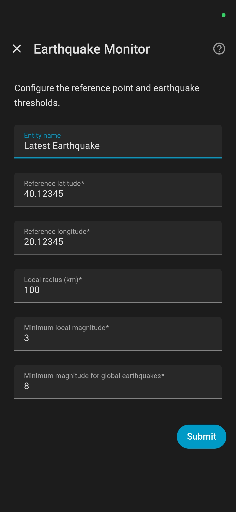

<p align="center">
  
</p>

# Earthquake Monitor
## **A Custom Integration for Home Assistant**

(c) 2026 Frank O. Fackelmayer, Ioannina, Greece – Contact: frank@fackelmayer.eu
 
Version 1.4.0


This integration reports the latest earthquake that matches a user-defined reference location and minimum magnitude threshold. It uses the EMSC real-time feed and exposes it as a sensor with rich attributes such as magnitude, time, depth, distance, bearing, and relative location. These attributes can then be used within Home Assistant, e.g. to display the information on a tile card, on the Home Assistant Map, or to trigger routines. 

**Disclaimer:** This integration is intended for informational use only. Under no circumstances should it be used to control critical processes, automated responses, safety-relevant systems, or infrastructure.

## What this integration does

Earthquake Monitor connects to the [**real-time WebSocket feed**](https://seismicportal.eu/realtime.html) of the [European-Mediterranean Seismological Centre (EMSC)](https://www.emsc.eu/) and keeps track of the most recent earthquake that matches the configured criteria. Despite the name, the EMSC feed covers all earthquakes worldwide.

The integration provides a Home Assistant sensor that includes:

- magnitude
- local and UTC timestamps
- depth
- region
- epicenter coordinates
- distance from a configured reference point
- bearing from the reference point
- relative location such as `42.3 km SW of reference point`
- country of epicenter
- nearest city (population >25000) to epicenter


The integration is intended for users who want a meaningful and stable “latest earthquake” entity in Home Assistant rather than observing a raw stream of feed updates in a web browser. It filters the feed and reports local earthquakes if they are within the configured radius around a reference point (typically, the user's home zone) and above the configured magnitude threshold. Stronger earthquakes outside the local radius are reported if they exceed a separate global threshold. Note that these will overwrite weaker local earthquakes. If this is not desired, set the global threshold to 10. 

This integration was inspired by the [**EMSC Earthquake** custom integration](https://github.com/febalci/ha_emsc_earthquake) by [febalci](https://github.com/febalci), but provides revised selection logic, improved usability, persistence, localization, and richer location metadata.

**Main improvements include:**

- **Improved event selection logic**  
  The EMSC feed reports both *new* events and *updates* to older events. The Earthquake Monitor entity discriminates between these in its Action attribute, which is \`create\` for new events, or \`update\` for older events. If a newer earthquake has already been accepted, later updates to an older earthquake will be ignored. This prevents corrections to older events from overwriting the true latest event. Thus, the entity always provides the details (new or updated) of the latest recorded earthquake.

- **Improved usability**
  Configuration settings are validated to only allow meaningful values. 

- **Relative location information**
  The sensor provides distance, bearing, and a readable relative location based on the configured reference point. Since v1.4 it also provides the country of the epicenter and the name of the nearest city to the epicenter.

- **Map support**
  The sensor correctly implements the attributes Latitude and Longitude so that events can be displayed directly on Home Assistant map cards.

- **Persistence across restarts**  
  The last accepted earthquake is restored after a restart of Home Assistant.

- **Expanded translations and improved configuration flow with validation of the user input**
  Available translations are listed below. 


## Installation

### Installation through the Home Assistant Community Store (HACS)

The integration can be installed through HACS following these steps:

1.	Add ```https://github.com/fra-yer/Earthquake-Monitor``` to **HACS → Custom repositories** with type **Integration**
2.	Open the repository in HACS and click **Download**
3.	Restart Home Assistant
4.	Go to **Settings → Devices & Services → Add Integration**
5.	Search for **Earthquake Monitor**
6.	Complete the configuration dialog, following the guidelines below


### Manual installation

Alternatively, the integration can be installed manually from this Github repository:

1. Copy the `earthquake_monitor` folder (with all its contents) into:
```
	/config/custom_components/
```
2. Restart Home Assistant
3. Go to **Settings → Devices & Services → Add Integration**
4. Search for **Earthquake Monitor**
5. Complete the configuration dialog, following the guidelines below


## Configuration

All relevant parameters for the Earthquake Monitor can be set on the configuration page that appears automatically when the integration is started for the first time, or when the cog icon of an entity (on the main page of the integration) is clicked. See below for a detailed description of the individual parameters and their default values. You can set up more than one entity, which will provide independent sensors within Home Assistant (e.g. for two different zones of interest). 

<p align="center">
  
</p>

### Entity name

The display name of the sensor entity created by the integration. This field is only shown when the sensor is set up for the first time. Default is "Latest Earthquake" (or the equivalent in local translations). Keep it as the default unless you are not happy with this name. *If you create more than one entity, make sure you give them different names so you can tell them apart!*

### Reference latitude

Latitude of the point from which local distance and bearing are calculated. If the user has defined a zone named "Earthquake Reference" (or "earthquake_reference") in Home Assistant -> Settings -> Areas, Labels & Zones -> Zones, the center of this zone will be used as the default setting for the latitude and the radius. If no such zone exists, the integration will use the latitude of the user's home zone, rounded to 5 digits. This corresponds to an accuracy of around 1 m on the earth's surface. More than 5 decimal digits may be defined here, but provide no benefit.

### Reference longitude

Longitude of the point from which local distance and bearing are calculated. As for the latitude, the longitude will default to the center of the "Earthquake Reference" zone, or of the user's home zone. Also for longitude, more than 5 decimal digits provide no benefit.

### Local radius (km)

The radius around the reference point within which earthquakes should be reported. If an "Earthquake Reference" zone exists, its radius will be used, otherwise a default of 100 km will apply. The maximum that can be set is 500 km.

### Minimum local magnitude

The minimum magnitude required for a local earthquake to be reported. Values from 0 to 10 are accepted. Values lower than 3 represent earthquakes that are too weak to be felt by humans; thus, setting the minimum local magnitude to less than 3 will report many insignificant earthquakes, and should be avoided. Check the information about earthquake magnitudes below. The default value will be magnitude 2.5.

### Minimum magnitude for global earthquakes

A second threshold that allows stronger earthquakes outside the local radius to be accepted as well. Values from 0 to 10 are accepted. Note that this global threshold cannot be set lower than the local minimum threshold. The default value is 8, which will only report very major earthquakes outside the local radius. *Set it to 10 if you do NOT want global earthquakes to be reported at all.*


## Local radius vs global threshold

The integration uses two separate acceptance rules, which allow you to monitor nearby small-to-moderate earthquakes while still catching major earthquakes elsewhere:

### 1. Local earthquakes

An earthquake is reported if it is:
- within the configured local radius around the reference point
- and at or above the configured minimum local magnitude

### 2. Global earthquakes

An earthquake is also reported (and overwrites the latest local earthquake) if it is:
- outside the local radius
- but at or above the configured minimum magnitude for global earthquakes


## Timestamps
The sensor reports the time of the latest event in several forms, for maximum compatibility and flexibility. These include the raw timestamps as reported by the EMSC feed (both as local time and UTC time), and timestamps in a more user-friendly formatted way. In particular, the timestamps are as follows: 

- Time - gives the time of the actual event, formatted in a user-friendly way
- Time utc - as above, but for the time in UTC
- Lastupdate - gives the time of the last update of the latest event, in a user-friendly way
- Lastupdate utc - as above, but for the time in UTC
- Time raw - original timestamp of the actual event
- Time utc raw - as above, but for the time in UTC
- Lastupdate raw - original timestamp of the last update
- Lastupdate utc raw - as above, but for the time in UTC

Important note: When you display these timestamps in the Details view of the entity itself, the "raw" time of the event, or its latest update, will be identical between UTC and local. This is not a bug in the integration, but the result of Home Assistant trying to be "helpful" and converting every timestamp to local time for display. Internally, the timestamps are correct and can be used, e.g. in an automation. The benefit of these "raw" timestamps is that they are automatically formatted in a way that fits to the language and location.  

## Location of an earthquake

The sensor reports the raw geographical coordinates (attributes Latitude and Longitude) and geographic location (attribute Region) it received from the EMSC feed. In addition, the integration calculates the following attributes that can be used for display or automations:

- Distance km: gives the distance from the configured reference point in kilometers
- Bearing deg: gives compass bearing from the reference point (where 0 is North, 90 is East, etc.)
- Bearing text: gives the bearing from the reference point as text (e.g. "NW" for north-west)
- Relative location: gives the location relative to the reference point (e.g. "24.4km NW of reference point")

Note that the Region attribute gives the Flinn-Engdahl region, a standardized geographic seismic zone name assigned from the latitude and longitude of an earthquake’s epicenter. This will, for example, show GREECE or NEAR N COAST OF PAPUA, INDONESIA. This attribute is *not a political boundary or a damage zone*. For example, two nearby quakes on opposite sides of a regional boundary may appear under different region names even if they are geographically close. Do not use this to assign the earthquake to a country!

## Persistence across restarts

Earthquake Monitor restores the last accepted earthquake after Home Assistant restarts.

This means:
- the sensor does not revert to an empty ("unknown") state after restart
- the most recent accepted earthquake and its attributes remain available
- the restored event continues to serve as the reference for rejecting updates to older events


## Map support

The sensor includes the attributes latitude and longitude, which allow Home Assistant to directly display the earthquake event on the built-in Home Assistant Map Card. Note that these attributes are initially empty, until the first earthquake was recorded. In practice, this means that the entity of Earthquake Monitor will not show up in the visual editor of the Map Card before the first event is available. If you do not want to wait for the first earthquake, you can set up the card manually in the code editor, like so: 

```yaml
type: map
entities:
  - zone.home
  - sensor.latest_earthquake
default_zoom: 8
auto_fit: true
```

If you chose a different name for the entity during the initial configuration, use this name instead. If, for example, you named the entity last_earthquake, use sensor.last_earthquake in the card configuration.


## Translations

At the time of initial publishing, the Earthquake Monitor is available in 12 languages. These were selected to provide a broad coverage of potential users - both in terms of earthquake relevance and Home Assistant user base. In particular, Earthquake Monitor is currently available in **English, German, Greek, Spanish, French, Italian, Dutch, Japanese, Polish, Portuguese, Brazilian Portuguese, and Turkish**. Except for the first four, I do not speak these languages and the translations were created with the help of AI (ChatGPT GPT 5.4 Thinking). If you are a native speaker of any of these languages and find a mistake, please notify me so I can correct it. 
If you are a native speaker of any other language that you want to see implemented, please contact me, too.

## Known limitations

- The integration uses the EMSC feed as its only data source, and depends on a WebSocket connection to the EMSC service.
- If the upstream feed becomes unavailable, no new earthquake data can be received. This can happen for a variety of reasons; e.g. the services were temporarily unavailable on April 16, 2026 from 08:00 to 12:00 CET due to mandatory electrical safety shutdown tests.
- According to the website, the feed aims at "(near) Realtime Notification", but delays of a few minutes are normal, especially for weak earthquakes
- In a few cases, earthquakes are reported with a longer delay (I observed up to 30 minutes delay). This is a limitation of the feed, not a bug in the integration. The sensor can only report earthquakes when they show up in the feed.
- The sensor represents one current event per entity, not a list or history of earthquakes. Older events are shown in Activity of the entity, but only with its magnitude and timestamp (no rich attributes).
- while more than one entity (sensor) can be configured, in practice it is best to limit the number to two or three.
- Time formatting and wording may still be refined in future versions.


## Planned improvements

This project may be extended in the future with:
- improved websocket handling (only relevant for larger number of entities)
- additional translations based on user requests and suggestions
- more formats for "friendly" timestamps
- additional diagnostics and system health information
- optional support for other earthquake data sources


## Earthquake Magnitude
The crust of the Earth is constantly stressed by tectonic forces. When this stress becomes great enough to rupture the crust, or to overcome the friction that prevents one block of crust from slipping past another, energy is released in the form of seismic waves. These waves travel through the ground and cause a ground-shaking "quaking" event when they reach the surface. Effects are strongest at the so called epicenter, which is the point on the Earth's surface directly above the point where the earthquake originates. The "strength" of an earthquake is described as its magnitude, which is an estimate of the energy released within the crust. There are different scales for earthquake magnitudes, based on different equations that derive the value from measurements of physical characteristics of a seismic wave, such as its timing, orientation, amplitude, frequency, and duration. For a more detailed description, see [this article on Wikipedia](https://en.wikipedia.org/wiki/Seismic_magnitude_scales). 

The entity of Earthquake Monitor records the used scale for a specific earthquake in the Magtype attribute. The most common scales are the Richter scale, which is represented by Magtype ml ("local magnitude"), and the "moment magnitude" scale represented by Magtype mw. In particular, for very large earthquakes, moment magnitude gives the [most reliable estimate](https://www.usgs.gov/faqs/moment-magnitude-richter-scale-what-are-different-magnitude-scales-and-why-are-there-so-many?utm_source=chatgpt.com) of earthquake size. The Richter scale was designed for shallow, regional earthquakes. Therefore, seismologists often use the Moment Magnitude Scale (Magtype mw) to describe large quakes, as the original Richter scale becomes less accurate above magnitude 7.0. However, for general "felt" distances, the values remain comparable and differences are mainly of academic interest. This may be the reason that, although scientifically incorrect, Mw magnitudes are often referred to as "Richter scale" values in the general press. 

All commonly used magnitude scales are logarithmic scales - this means that a difference of 1.0 in magnitude corresponds to about 10 times greater wave amplitude (ground shaking) and roughly 32 times more energy release. The shaking actually felt at the surface also depends on distance, depth, local geology, and building conditions. 

In practice, tectonic earthquakes on Earth appear to be limited by the finite size of fault systems. The largest ever recorded earthquake was Mw 9.5 (the [Valdivia Earthquake](https://en.wikipedia.org/wiki/1960_Valdivia_earthquake) in Chile on May 22, 1960). A tectonic Mw 10 event is generally considered implausible because it would require a rupture so long and so deep that no known fault system on Earth is large enough to produce it. Larger quakes would only be possible by extraterrestrial events, such as the impact of an asteroid, but this is outside the realm of seismology. 
On the other "end" of the scale, earthquakes can have negative magnitudes; that means they are smaller than a magnitude 0 event on a logarithmic scale. Magnitude 0 compares to a distant truck or a small machine running in another part of a building. Consequently, these tiny microseismic events are not reported by the EMSC feed, and will also not appear in Earthquake Monitor.

In practice, although the magnitude given in the EMSC feed is measure of earthquake size, it is also a good estimate for the intensity of the ground-shaking, although other factors such as the soil condition also contribute to how strong (and to which distance) an earthquake is felt. The following table gives a very rough "rule of thumb" of earthquake intensities. 

### Earthquake magnitude and typical felt distance

| Magnitude | Typical Effects | Max Distance Usually Felt |
|---|---|---|
| 2.0 - 2.9 | Usually not felt, but recorded by seismographs | 0 - 10 km (rarely felt by humans) |
| 3.0 - 3.9 | Often felt by people indoors, especially when not in motion | 10 - 50 km |
| 4.0 - 4.9 | Felt by most people; unstable objects move; windows rattle | 50 - 150 km |
| 5.0 - 5.9 | Felt by everyone; slight damage to weak buildings | 150 - 300 km |
| 6.0 - 6.9 | Strong shaking; damage to poorly constructed buildings | 300 - 700 km |
| 7.0 - 7.9 | Major earthquake; serious damage over large areas | 700 - 1,000+ km |
| 8.0 and above | Great earthquake; usually causes severe destruction near the epicenter | 1,500 - 2,000+ km |

### Why \`Felt Distance\` Varies
The table above gives a typical range, but two earthquakes with identical magnitude can feel very different:

Regional Geology: When the crust is older and more "brittle," seismic waves can travel much further without losing energy than in tectonically active regions. A cracked, warm crust dampens the vibrations quickly. For example, an earthquake in Virginia might be felt 800 km away, whereas a similar quake in California, where the crust is fragmented by many faults, might only be felt for 300 km. Soft soils amplify shaking, while bedrock tends to shake less.

Depth: A shallow earthquake (0–70 km deep) is felt much more intensely near the surface, while a deep earthquake (300+ km) might be felt over a very large area but with much less violent shaking. An earthquake of magnitude 8 at a depth of greater than 300 km may hardly be noticeable on the surface, while a similarly strong earthquake at a depth of 5 km is devastating. For example, the magnitude 7.9 [Ogasawara earthquake](https://en.wikipedia.org/wiki/2015_Ogasawara_earthquake) near Bonin Islands, Japan on May 30, 2015, at >660 km depth, was widely described by people as mild rocking, and caused no significant damage. In contrast, the [2025 Myanmar earthquake](https://en.wikipedia.org/wiki/2025_Myanmar_earthquake) on March 28, 2025, was a magnitude 7.7–7.9 (sources vary slightly) at a very shallow depth of 10 km, and caused devastating near-source shaking with heavy loss of life and widespread destruction along the Sagaing Fault near Mandalay. 

## License
This project is licensed under the MIT License – see the [LICENSE file](https://github.com/fra-yer/Earthquake-Monitor/blob/main/LICENSE) for details.
